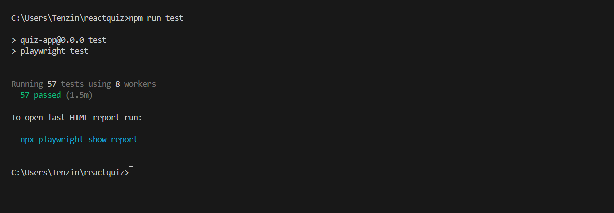
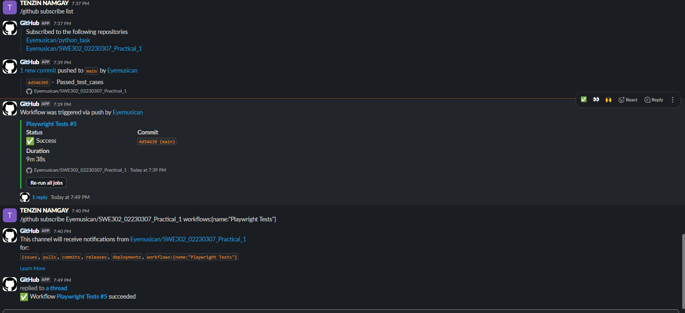

# Kahoot Clone – Test Status

## Overview

This project includes comprehensive automated tests to ensure the reliability and correctness of the Kahoot Clone application.

## Test Summary

- **All test cases have passed successfully.**
- Test coverage includes quiz flow, timer, game state, UI/UX, edge cases, and data validation.

## Test Files

- [tests/quiz-flow.spec.ts](tests/quiz-flow.spec.ts)
- [tests/timer.spec.ts](tests/timer.spec.ts)
- [tests/game-state.spec.ts](tests/game-state.spec.ts)
- [tests/ui-ux.spec.ts](tests/ui-ux.spec.ts)
- [tests/edge-cases.spec.ts](tests/edge-cases.spec.ts)
- [tests/data-validation.spec.ts](tests/data-validation.spec.ts)


## How to Run Tests

1. Start the development server:
   ```sh
   npm run dev
   ```
2. In a separate terminal, run tests:
   ```sh
   npm run test
   ```

## Test Results

- All tests: **Passed**
- See [TEST_SUMMARY.md](TEST_SUMMARY.md) for detailed coverage and test attribute information.

---

_Last test run status: **Passed** ([test-results/.last-run.json](test-results/.last-



## Real-time Development Notifications
Our project automatically notifies the team via Slack when:
-  Commits are ***pushed*** to the repository
-  ***Tests are executed*** (57 Playwright tests)
-  ***Test results*** - All tests PASSED in 9m 38s



This keeps the development team instantly informed about code changes and ensures all tests pass before deployment.